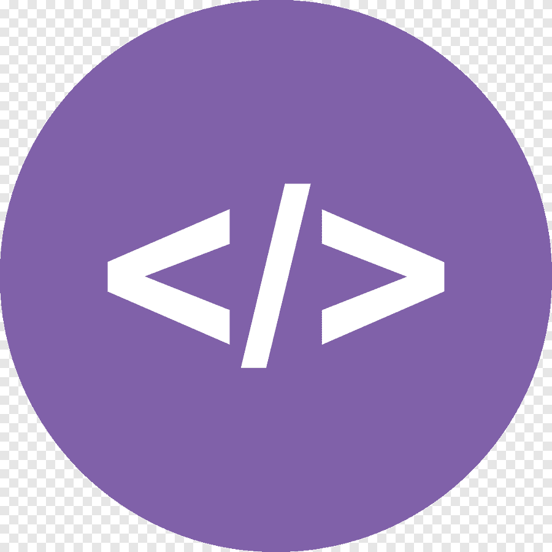

<h1 align="center">Hola, soy Cele  </h1>

<tabla alinear="derecha">
<tr>
<td>

  
[][instagram]
[][linkedin]
[][behance]

</td>
</tr>
</tabla>

  
:zap: About me!

### ✨ I’m Celeste Delgado

⚡ Developer Full Stack in training at UNLAM- National University of Matanza

📍 I am in transition of the computer engineering career

🤓 I have work experience in the area of computer crimes and investigations as an Argentine Federal Police Officer
 and today I study different languages to work in that area since it is my passion
   
👾 I'm very curious and that's why you start studying programming 
 
</detalles>

 

<h3 align="center">  Languages and Tools</h3> 

  

   
   
   
   
   
   
   
   
   
   
   
   
   
   
  
  
    

---

<h3 align="Center"> GitHub Stats </h3>

  <a href="https://github.com/CeleDelgado">
  

 

                                                                                                                                                   

[instagram]: https://www.instagram.com/___cele_/
[linkedin]: https://www.linkedin.com/in/celeste-delgado
[behance]: https://www.behance.net/celedelgado

