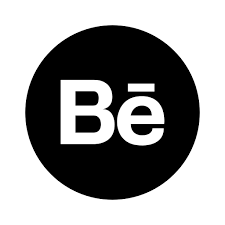

<h1 align="center">Hi, i´m Cele  </h1>
<h1 align="center">
    
</h1>

<tabla alinear="derecha">
<tr>
<td>

<table align="right">
<tr>
<td>   
[]
[]
[]
</td>
</tr>
</table>

</td>
</tr>
</tabla>

  
:zap: About me!

### ✨ I’m Celeste Delgado

⚡ Developer Full Stack in training at UNLAM- National University of Matanza

📍 I am in transition of the computer engineering career

🤓 I have work experience in the area of computer crimes and investigations as an Argentine Federal Police Officer
 and today I study different languages to work in that area since it is my passion
   
👾 I'm very curious and that's why you start studying programming 
 
</detalles>

 

---
 

<h3 align="center">  Languages and Tools</h3> 

  

   
   
   
   
   
   
   
   
   
   
   
   
   
   
  
  
    

---

<h3 align="Center"> GitHub Stats </h3>

  <a href="https://github.com/CeleDelgado">
  
  

  
  ---
   

<picture>
  <source
    media="(prefers-color-scheme: dark)"
    srcset="https://raw.githubusercontent.com/platane/snk/output/github-contribution-grid-snake-dark.svg"
  />
  <source
    media="(prefers-color-scheme: light)"
    srcset="https://raw.githubusercontent.com/platane/snk/output/github-contribution-grid-snake.svg"
  />
  
</picture>

 ---
   
                                                                                                                                                   

[instagram]: https://www.instagram.com/___cele_/
[linkedin]: https://www.linkedin.com/in/celeste-delgado
[behance]: https://www.behance.net/celedelgado

